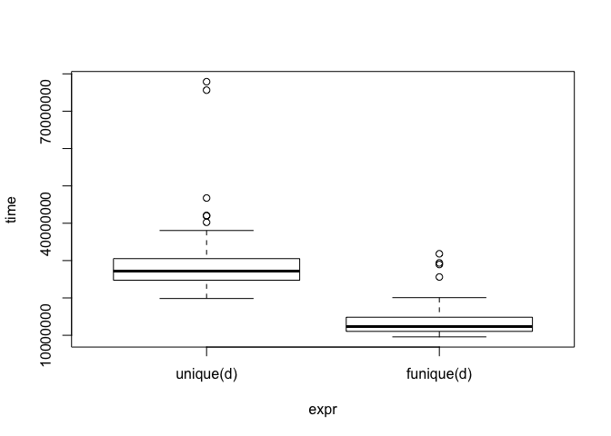
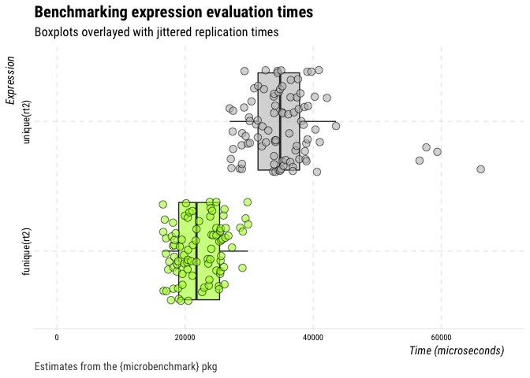

<!-- README.md is generated from README.Rmd. Please edit that file -->
funique
=======

⌚️ A faster `unique()` function

Installation
------------

You can install the released version of funique from Github with:

``` r
## install from github
devtools::install_github("mkearney/funique")
```

Usage
-----

There's one function `funique()`, which is the same as `base::unique()` only optimized to be faster when data contain date-time variables.

Speed test: `funique()` vs. `base::unique()`
--------------------------------------------

The code below creates a data frame with several duplicate rows and then compares performance (in time) of `funique()` versus `base::unique()`.

``` r
## create data set with a date-time column
d <- datasets::mtcars
d$dttm <- Sys.time() + runif(nrow(d), -1000, 1000)

## create multiple data frames with duplicate rows
d <- lapply(1:50, function(.) rbind(d, d[sample(seq_len(nrow(d)), 20), ]))
## merge into single data frame
d <- do.call("rbind", d)

## compare times between funique() and base::unique()
library(microbenchmark)

## benchmarks
(mb <- microbenchmark(unique(d), funique(d), unit = "relative"))
#> Unit: relative
#>        expr     min      lq    mean  median      uq     max neval
#>   unique(d) 2.07169 2.24016 2.14428 2.20406 2.05754 2.44785   100
#>  funique(d) 1.00000 1.00000 1.00000 1.00000 1.00000 1.00000   100

## make sure the output is the same
identical(unique(d), funique(d))
#> [1] TRUE

## plot
plot(mb)
```



Here's another test this time using duplicate-infested Twitter data.

``` r
## search for data on 1,000 tweets
rt <- rtweet::search_tweets("lang:en", n = 500, verbose = FALSE)

## create duplicates
rt2 <- rbind(rt, rt[sample(1:nrow(rt), 100), ])

## benchmarks
(mb <- microbenchmark(unique(rt2), funique(rt2), unit = "relative"))
#> Unit: relative
#>          expr     min     lq    mean  median      uq     max neval
#>   unique(rt2) 1.69278 1.5025 1.47479 1.53282 1.55658 1.11853   100
#>  funique(rt2) 1.00000 1.0000 1.00000 1.00000 1.00000 1.00000   100

## make sure the output is the same
identical(unique(rt2), funique(rt2))
#> [1] TRUE

## plot
plot(mb)
```


