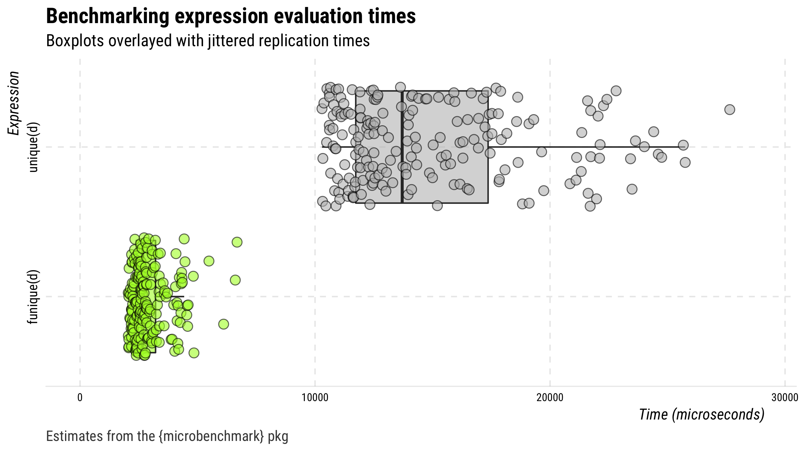

<!-- README.md is generated from README.Rmd. Please edit that file -->

# funique 

[](https://travis-ci.org/mkearney/funique)
[](https://www.tidyverse.org/lifecycle/#experimental)

> ⌚️ A faster `unique()` function

## Installation

You can install the released version of funique from Github with:

``` r
## install remotes pkg if not already
if (!requireNamespace("remotes", quietly = TRUE)) {
  install.packages("remotes")
}

## install funique from github
remotes::install_github("mkearney/funique")
```

## Usage

There’s one function `funique()`, which is the same as `base::unique()`
only optimized to be faster when data contain date-time variables.

## Speed test: `funique()` vs. `base::unique()`

The code below creates a data frame with several duplicate rows and then
compares performance (in time) of `funique()` versus `base::unique()`.

``` r
## set seed
set.seed(20180812)

## generate data
d <- data.frame(
  x = rnorm(1000),
  y = seq.POSIXt(as.POSIXct("2018-01-01"),
    as.POSIXct("2018-12-31"), length.out = 10))

## create data frame with duplicate rows
d <- d[c(1:1000, sample(1:1000, 500, replace = TRUE)), ]
row.names(d) <- NULL

## check the output against base::unique
identical(unique(d), funique(d))
#> [1] TRUE

## bench mark
(m <- microbenchmark::microbenchmark(unique(d), funique(d), 
  times = 200, unit = "relative"))
#> Unit: relative
#>        expr     min      lq    mean  median      uq     max neval
#>   unique(d) 4.98663 4.92073 4.94704 5.14552 5.38573 2.02836   200
#>  funique(d) 1.00000 1.00000 1.00000 1.00000 1.00000 1.00000   200

## plot
plot(drop_hl(m, n = 4)) + 
  ggplot2::ggsave("man/figures/r1.png", width = 8, height = 4.5, units = "in")
```

<p align="center">



Here’s another test this time using duplicate-infested Twitter data.

``` r
## search for data on 100 tweets
rt <- rtweet::search_tweets("lang:en", verbose = FALSE)

## create duplicates
rt2 <- rt[sample(1:nrow(rt), 1000, replace = TRUE), ]

## benchmarks
(mb <- microbenchmark::microbenchmark(
  unique(rt2), funique(rt2), unit = "relative"))
#> Unit: relative
#>          expr     min      lq    mean median      uq      max neval
#>   unique(rt2) 1.56861 1.57622 1.35692 1.5524 1.35336 0.393617   100
#>  funique(rt2) 1.00000 1.00000 1.00000 1.0000 1.00000 1.000000   100

## make sure the output is the same
identical(unique(rt2), funique(rt2))
#> [1] TRUE

## plot
plot(drop_hl(m, n = 4)) + 
  ggplot2::ggsave("man/figures/r2.png", width = 8, height = 4.5, units = "in")
```

<p align="center">


