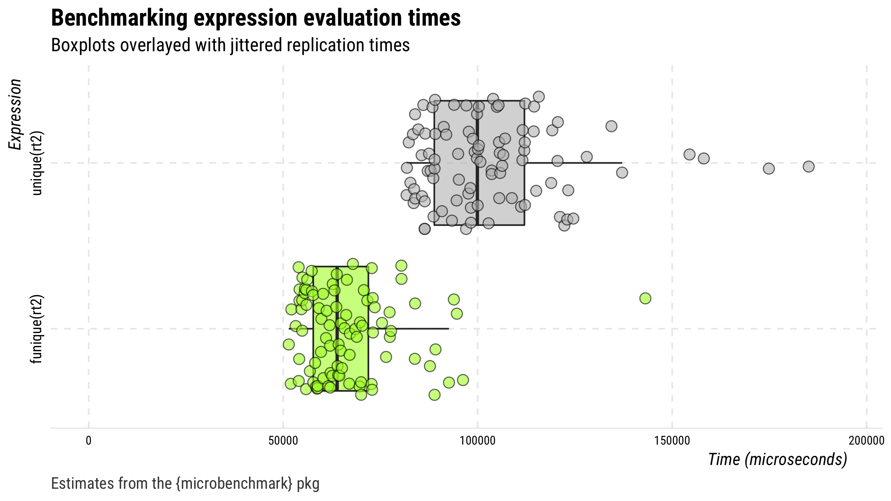

<!-- README.md is generated from README.Rmd. Please edit that file -->

# funique 

[](https://www.tidyverse.org/lifecycle/#experimental)

⌚️ A faster `unique()` function

## Installation

You can install the released version of funique from Github with:

``` r
## install from github
devtools::install_github("mkearney/funique")
```

## Usage

There’s one function `funique()`, which is the same as `base::unique()`
only optimized to be faster when data contain date-time variables.

## Speed test: `funique()` vs. `base::unique()`

The code below creates a data frame with several duplicate rows and then
compares performance (in time) of `funique()` versus `base::unique()`.

``` r
## create data set with a date-time column
d <- datasets::mtcars
d$dttm <- Sys.time() + runif(nrow(d), -1000, 1000)

## create multiple data frames with duplicate rows
d <- lapply(1:50, function(.) rbind(d, d[sample(seq_len(nrow(d)), 20), ]))
## merge into single data frame
d <- do.call("rbind", d)

## compare times between funique() and base::unique()
library(microbenchmark)

## benchmarks
(mb <- microbenchmark(unique(d), funique(d), unit = "relative"))

## make sure the output is the same
identical(unique(d), funique(d))

## plot
plot(mb)
```

<p align="center">


Here’s another test this time using duplicate-infested Twitter data.

``` r
## search for data on 100 tweets
rt <- rtweet::search_tweets("lang:en", verbose = FALSE)

## create duplicates
rt2 <- rt[sample(1:nrow(rt), 1000, replace = TRUE), ]

## benchmarks
(mb <- microbenchmark(unique(rt2), funique(rt2), unit = "relative"))

## make sure the output is the same
identical(unique(rt2), funique(rt2))

## plot
plot(mb)
```

<p align="center">


